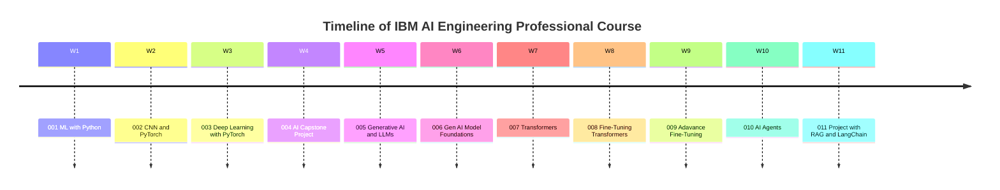

## Main Course 

**[IBM AI Engineering Professional Certificate](https://www.coursera.org/professional-certificates/ai-engineer#courses)**

![[Pasted image 20250411124302.png]]

| Index | Course URL                                                                                                                                                             | Local Note                                |     |
| ----- | ---------------------------------------------------------------------------------------------------------------------------------------------------------------------- | ----------------------------------------- | --- |
| 1     | [Machine Learning with Python](https://www.coursera.org/learn/machine-learning-with-python?specialization=ai-engineer)                                                 | [[IBM- 1 - Machine Learning with Python]] |     |
| 2     | [CNN and PyTorch](https://www.coursera.org/learn/deep-neural-networks-with-pytorch/home/week/1)                                                                        | [[IBM- 2 - DNN and PyTorch]]              |     |
| 3     | [Deep Learning with PyTorch](https://www.coursera.org/learn/deep-learning-with-pytorch)                                                                                |                                           |     |
| 4     | [AI Capstone Project with Deep Learning](https://www.coursera.org/learn/ai-capstone-project-with-deep-learning)                                                        |                                           |     |
| 5     | [Generative AI and LLMs: Architecture and Data Preparation](https://www.coursera.org/learn/generative-ai-llm-architecture-data-preparation?specialization=ai-engineer) |                                           |     |
| 6     | [Gen AI Model Foundations for NLP & Language Understanding](https://www.coursera.org/learn/gen-ai-foundational-models-for-nlp-and-language-understanding)              |                                           |     |
| 7     | [Generative AI Language Modeling with Transformers](https://www.coursera.org/learn/generative-ai-language-modeling-with-transformers)                                  |                                           |     |
| 8     | [Generative AI Engineering and Fine-Tuning Transformers](https://www.coursera.org/learn/generative-ai-engineering-and-fine-tuning-transformers)                        |                                           |     |
| 9     | [Generative AI Advance Fine-Tuning for LLMs](https://www.coursera.org/learn/generative-ai-advance-fine-tuning-for-llms)                                                |                                           |     |
| 10    | [Fundamentals of Building AI Agents using RAG and LangChain](https://www.coursera.org/teach/course-6-gen-ai-tbd/course/overview)                                       |                                           |     |
| 11    | [Project: Generative AI with RAG and LangChain](https://www.coursera.org/learn/project-generative-ai-with-rag-and-langchain)                                           |                                           |     |

## 参考资料

[【2025版】这绝对是B站最好的Pytorch天花板教程，从入门到实战，通俗易懂，一套解决Pytorch框架所有问题！深度学习/人工智能/神经网络_哔哩哔哩_bilibili](https://www.bilibili.com/video/BV1JLPaeoE4L/?spm_id_from=333.337.search-card.all.click&vd_source=d2c6cad4e8b48a4a5ab3df7cb838685b)

[PyTorch documentation — PyTorch 2.6 documentation](https://pytorch.org/docs/stable/index.html)
